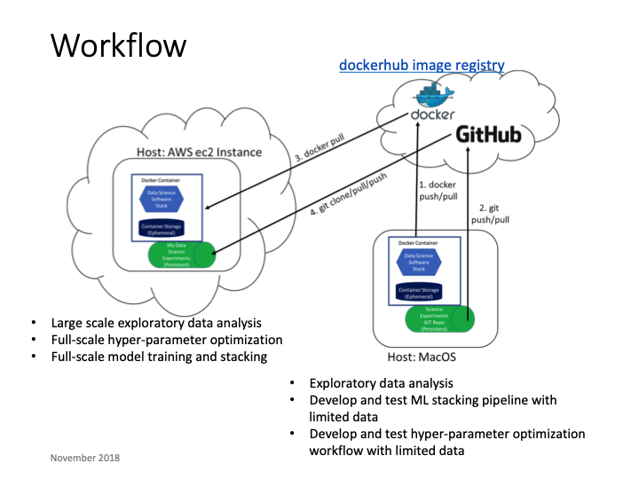

# Uber ludwig examples

Example code illustrating using Uber's [ludwig](https://uber.github.io/ludwig/) deep learning framework.

Objectives:
* Define Docker images for the Ludwig software stack, including both Tensorflow (cpu-enabled) and Tensorflow (gpu-enabled)
* Demonstrate running ludwig using command line execution in a Docker container
* Demonstrate running ludwig using Python api in a Docker container
* Generate modeling assessment visualizations, e.g., learning curves, confusion matrix, etc.
* Provide samples for various types of models:  image classification, text analytics, sentiment analysis, time series forecasting, etc.

## Repo Contents
|Directory|Description|
|---------|-----------|
|bin|bash scripts for various function|
|containers|Docker containers for ludwig software stack|
|kaggle_titanic|Kaggle Titanic predictive competition data set|
|mnist|Use of ludwig with mnist data set|
|text_classification|Text classification model|
|time_series|Time series forecasting temperature|

Preparatory steps:

* Create docker images with ludwig software stack.  Run the following bash script.
```
bin/build_images tf_cpu
bin/build_images tf_gpu
```

## Conceptual View

