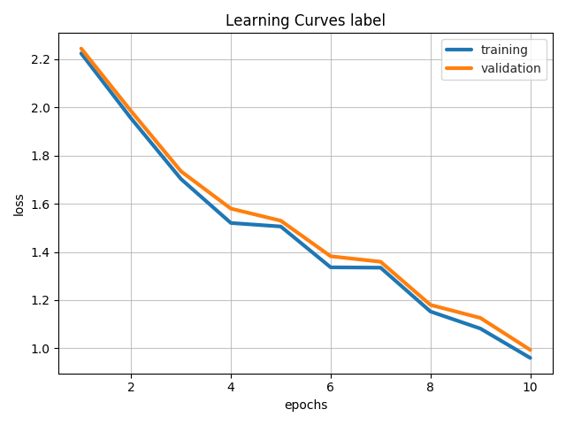
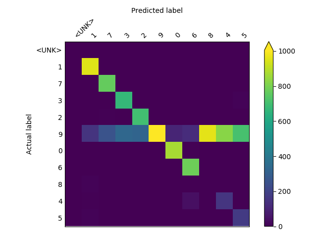

# MNIST Example

[ludwig example](https://uber.github.io/ludwig/examples/#image-classification-mnist) of training a CNN for MNIST hand-written data set.

* Set current working directory the `mnist` directory
* Prepare training and test data sets.  Run script: `bash create_mnist_dataset.sh`
* Train CNN model using command line.  
  * Train on cpu-based Docker container: `bash ludwig_cli.sh tf_cpu`
  * Train on gpu-based Docker container: `bash ludwig_cli.sh tf_gpu`
* Train CNN model using Python API and save trained model.  
  * Train on cpu-based Docker container: `bash ludwig_api_training.sh tf_cpu`
  * Train on gpu-based Docker container: `bash ludwig_api_training.sh tf_gpu`
* Run Python program to load saved model and run predictions on `mnist` test data set.
  * Make predictions using cpu-based Docker container: `bash ludwig_api_predictions.sh tf_cpu`
  * Make predictions using gpu-based Docker container: `bash ludwig_api_predictions.sh tf_gpu`

## Training Time
Summary of training time

|Environment|Seconds per epoch|
|-----------|-----------------|
|MacBook Pro (cpu)| 74 seconds|
|AWS p2.xlarge (Nvidia K80 gpu)| 6 seconds|

### Training time on MacOS (cpu).


### Training time on AWS (p2.xlarge(Nvidia K80 gpu) with AWS Deep Learning Base AMI) 


## Sample Visualizations
To generate the visualizations:
* Run cli example for generating visualizations: `bash ludwig_cli_viz.sh`
* Run python example (`model_visualization.py`) of invoking visualization api: `barh ludwig_api_visualizaiton.sh`

### Learning Curves


### Confustion Matrix


## Reset Example
If it is desired to remove old data pre-processing and results, run this command:
``` 
cd mnist
../bin/reset_example.sh
```