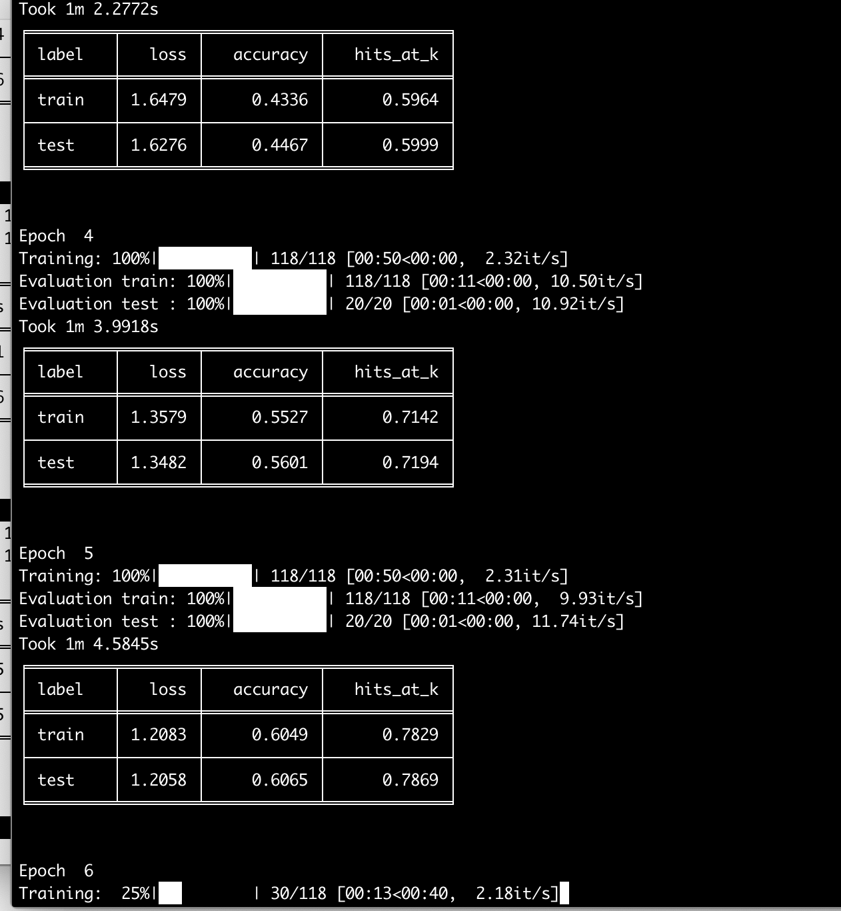

# MNIST Example

ludwig example of training a CNN for MNIST hand-written data set.

Use provided Docker containers to run this example.

* Prepare training and test data sets.  Run script: `bash create_mnist_dataset.sh`
* Train CNN model.  Run script: `bash ludwig_cli.sh`

## Training time on MacOS (cpu).  Approx 74 secs/epoch

## Training time on AWS (p2.xlarge(Nvidia K80 gpu) with AWS Deep Learning Base AMI)  Approx 6 secs/epoch
